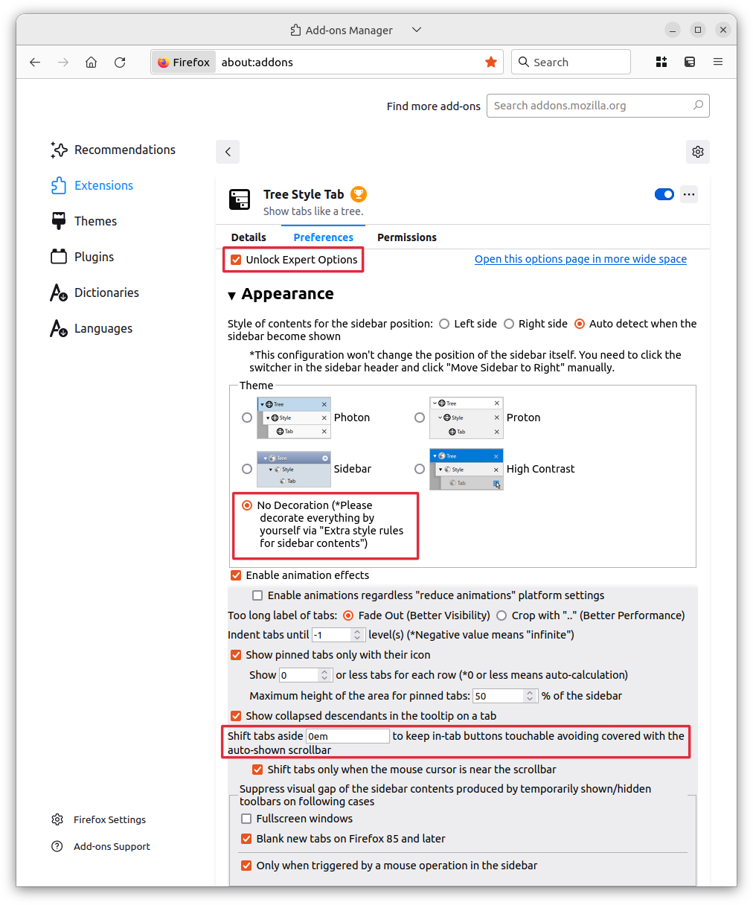
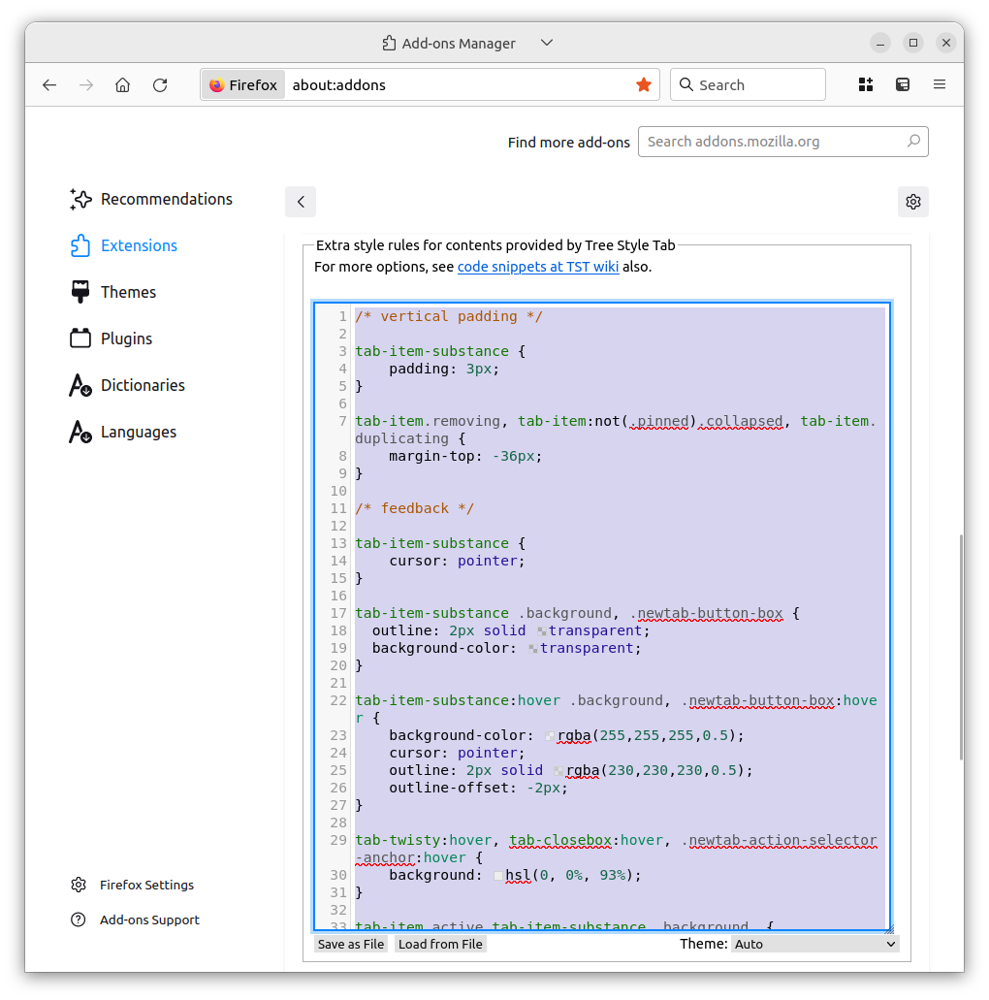

# tst-extra-style-rules

A custom style sheet for the [Tree Style Tab](https://github.com/piroor/treestyletab) extension.

## How to use

1) Select the `No decoration` option in the `Appearance` section

2) Check the `Unlock Expert Options` and set `Shift tabs aside` to `0em` in order to remove the animation while hovering the scrollbar area

3) paste the content of `extra-style-rules.css` in the textarea reserved for this purpose

